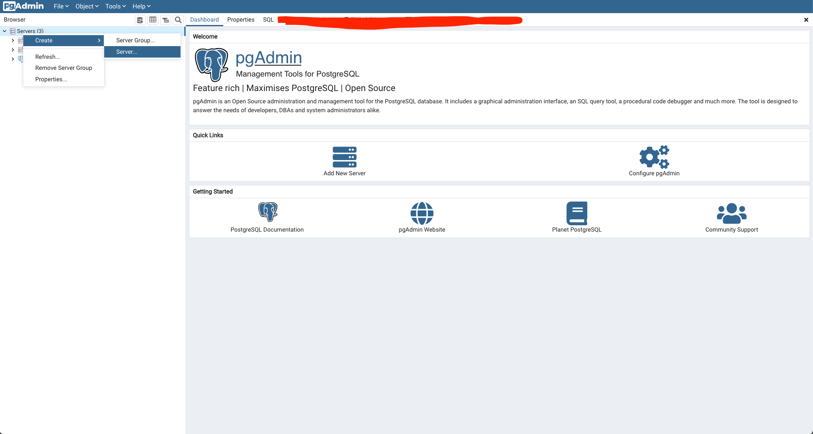
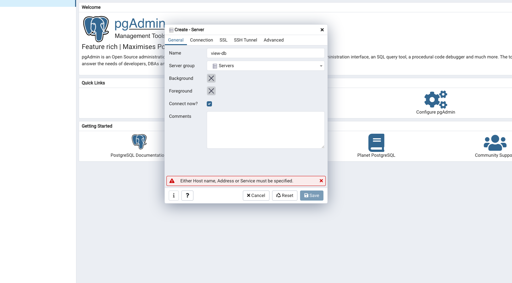
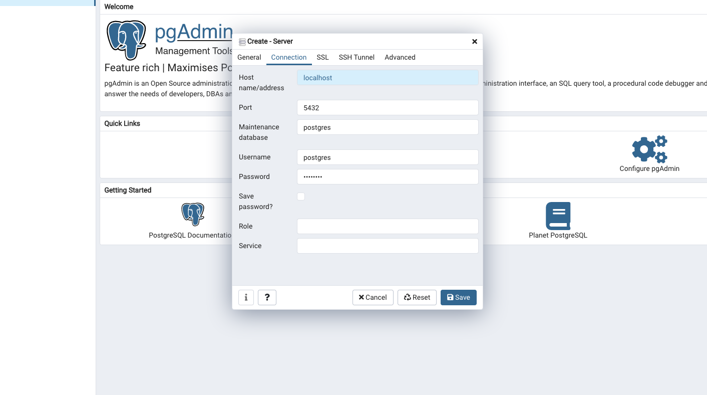
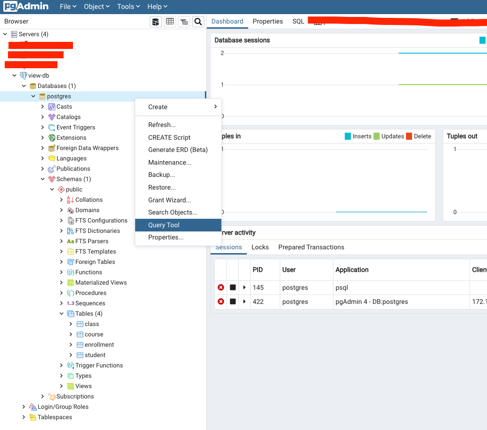

# View vs. Materialized View in PostgreSQL

We usually write complex SQL queries that require multiple joins. It is known that JOIN is a costly operation in SQL. Therefore, we should design our database in a way that we don't use JOIN too often. But what if we cannot? What if we have to design our database in such a way. Thankfully, PostgreSQL (and other SQL Databases) provides a solution: View and Materialized View. 

We will compare view, materialized view, and JOIN query with each other in terms of: Speed, Space using different datasets.

Let's start..

## Table of Content
- [View vs. Materialized View in PostgreSQL](#view-vs-materialized-view-in-postgresql)
  - [Table of Content](#table-of-content)
  - [View](#view)
  - [Materialized View](#materialized-view)
  - [Prerequisites](#prerequisites)
  - [Setting Up the Environment](#setting-up-the-environment)
  - [Creating the Database](#creating-the-database)
  - [Connecting to pgAdmin 4](#connecting-to-pgadmin-4)
  - [Comparison](#comparison)
  - [The Result](#the-result)
  - [Explanation](#explanation)

## View

A view is a way to encapsulate a query result into a view table. The view then can be queried like normal tables. However, the query is not stored on the disc, and is recomputed every time it is queried.

## Materialized View

Similar to view, the difference is that it is stored on the disc and NOT recomputed every time it is queried. The recomputation, however, is done manually.

## Prerequisites

We will be using docker in this experiment, you will need to install:

1. [Docker](https://docs.docker.com/get-docker/)
2. [pgAdmin 4](https://www.pgadmin.org/download/)

Please follow the instructions on the provided links.

## Setting Up the Environment

1. Open the terminal and write the following

```bash
docker run --name view-db -e POSTGRES_PASSWORD=postgres -p 5432:5432 -d postgres:13
```

Basically, this command will run a docker container with the following:

```
--name: a variable of our choice, in this case view-db
-e: an environment variable, in this case we want to modify the password POSTGRES_PASSWORD=postgres
-p: to map a port from the container to a port on docker host [host-port]:[container-port] 5432:5432 
-d: to start the container in detached mode
postgres:13 : the image name and its version
```

2. Make sure the image is running by

```bash
docker ps
```

You should see an output like this:

```bash
CONTAINER ID   IMAGE         COMMAND                  CREATED          STATUS          PORTS                    NAMES
1930f47f6f10   postgres:13   "docker-entrypoint.s…"   16 seconds ago   Up 15 seconds   0.0.0.0:5432->5432/tcp   view-db
```

3. Now we have everything ready, let's go inside the image

```bash
docker exec -it view-db /bin/bash
```

4. Now let's go to PostgreSQL terminal

```bash
su postgres
psql
```

## Creating the Database

1. Let's create our first table:

```sql
CREATE TABLE student(
    id BIGINT GENERATED ALWAYS AS IDENTITY,
    PRIMARY KEY(id),
    firstname VARCHAR(32) NOT NULL,
    lastname VARCHAR(32) NOT NULL,
    gender VARCHAR(6) NOT NULL CHECK (gender IN ('male', 'female'))
);
 
 
CREATE TABLE course(
    id BIGINT GENERATED ALWAYS AS IDENTITY,
    PRIMARY KEY(id),
    name VARCHAR(32) NOT NULL,
    credits INT NOT NULL
);
 
 
CREATE TABLE class(
    id BIGINT GENERATED ALWAYS AS IDENTITY,
    PRIMARY KEY(id),
    course_id BIGINT NOT NULL,
    FOREIGN KEY (course_id) REFERENCES course(id)
);
 
 
 
CREATE TABLE enrollment(
    id BIGINT GENERATED ALWAYS AS IDENTITY,
    PRIMARY KEY(id),
    class_id BIGINT NOT NULL,
    FOREIGN KEY (class_id) REFERENCES class(id),
    student_id BIGINT NOT NULL,
    FOREIGN KEY (student_id) REFERENCES student(id)
);
```

2. Generate random data (_THIS WILL TAKE SOME TIME TO COMPLETE_)

```sql
INSERT INTO student(firstname, lastname, gender)
SELECT md5(RANDOM()::TEXT), md5(RANDOM()::TEXT), CASE WHEN RANDOM() < 0.5 THEN 'male' ELSE 'female' END
FROM generate_series(1, 10000000);
 
 
INSERT INTO course(name, credits)
    SELECT md5(RANDOM()::TEXT), FLOOR(RANDOM() * 4) + 1
FROM generate_series(1, 4000);
 
 
INSERT INTO class(course_id)
    SELECT FLOOR(RANDOM() * 4000) + 1
FROM generate_series(1, 400000);
 
 
INSERT INTO enrollment (class_id, student_id)
    SELECT FLOOR(RANDOM() * 400000) + 1, FLOOR(RANDOM() * 10000000) + 1
FROM generate_series(1, 608000);
```

## Connecting to pgAdmin 4

To connect to pgAdmin 4:

1. Right-click on Servers on Browser panel → Create → Server


2. Name the server as view-db


3. Go to connection tab and fill it with the following (the password is: postgres)


4. Click save, and we are done.

## Comparison

Lets write some queries now.

1. Click on view-db → Databases → postgres → right-click on postgres → Query Tool


2. This is query we want to test:

```sql
SELECT class.id AS c_id, student.id AS s_id, course.id AS cr_id
FROM class, course, student, enrollment
WHERE
    class.course_id = course.id
    AND class.id = enrollment.class_id
    AND student.id = enrollment.student_id;
```

3. Let's create our views

```sql
CREATE VIEW my_view AS
    SELECT class.id AS c_id, student.id AS s_id, course.id AS cr_id
    FROM class, course, student, enrollment
    WHERE
        class.course_id = course.id
        AND class.id = enrollment.class_id
        AND student.id = enrollment.student_id;
 
 
CREATE MATERIALIZED VIEW my_materialized_view AS
    SELECT class.id AS c_id, student.id AS s_id, course.id AS cr_id
    FROM class, course, student, enrollment
    WHERE
        class.course_id = course.id
        AND class.id = enrollment.class_id
        AND student.id = enrollment.student_id;
```

4. Now we need to test using these queries

```sql
SELECT class.id AS c_id, student.id AS s_id, course.id AS cr_id
FROM class, course, student, enrollment
WHERE
    class.course_id = course.id
    AND class.id = enrollment.class_id
    AND student.id = enrollment.student_id;
 
 
SELECT *
FROM my_view;
 
 
SELECT *
FROM my_materialized_view;
```

5. Run each query alone on pgAdmin 4, you should see the time it takes on the bottom left corner of the screen

6. To get the space, open postgres terminal again and write the following (if you closed the terminal go back to [Setting the Environment](#setting-up-the-environment) section and follow step 3 & 4):

```bash
\dmv+
```

You should see an output like this:

```bash
Schema |         Name         |       Type        |  Owner   | Persistence |  Size   | Description
--------+----------------------+-------------------+----------+-------------+---------+-------------
 public | my_materialized_view | materialized view | postgres | permanent   | 30 MB   |
 public | my_view              | view              | postgres | permanent   | 0 bytes |
```

## The Result

|         | Time to Create | Query Time | Space |
| ------- | -------------- | ---------- | ----- |
| normal JOIN | N/A	| 10.484 sec | 0 MB |
| my_view | 0.041 sec | 10.250 sec | 0 MB |
| my_materialized_view | 12.765 sec | 0.513 sec | 30 MB |

## Explanation

The view basically is a form of hiding complex queries in virtual tables. They are not written on the disc, that's why the query time is similar to the normal query, and that's why it does not take any space. On the other hand, materialized views are written on the disc, and they are computed once, and the user updates them manually. This is the reason why it is much faster than the other, and that's why it takes time to create.
